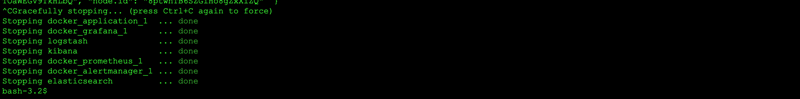
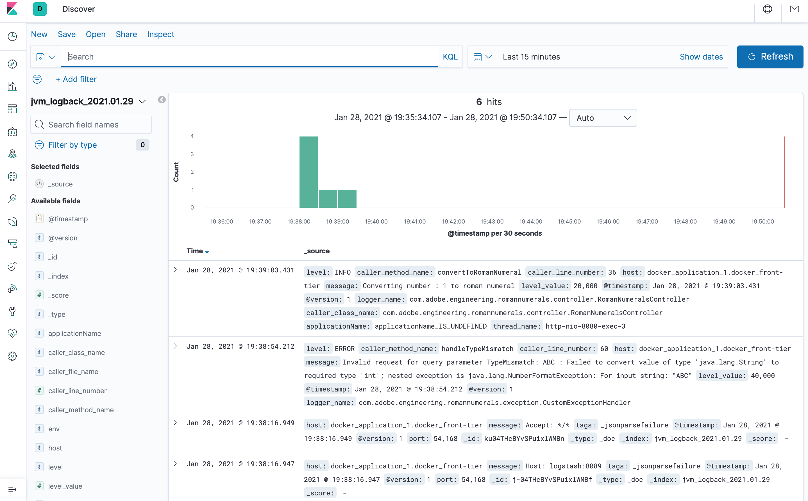

# Romannumeral - Conversion Microservice

## Project Requirement

**Write a service that would take integer as input and convert it to romannumeral**
>  
>
> The goal was to build /romannumeral but changed it to /api/v1/romannumeral to version the API

* Your HTTP Endpoint must accept a URI in this format:
  http://localhost:8080/romannumeral?query={integer} 
* {integer} should be any number between 1-255 unless you are asked for
    the extension (see below) 
* Extension 1: Expand the set of numbers to 1-3999
* Extension 3: Include dev-ops capabilities for metrics, monitoring, logging

**Roman Numeral Symbol Reference**

Wiki : https://en.wikipedia.org/wiki/Roman_numerals

**Symbol**|**I**|**V**|**X**|**L**|**C**|**D**|**M**
:-----:|:-----:|:-----:|:-----:|:-----:|:-----:|:-----:|:-----:
Value|1|5|10|50|100|500|1000
        
## System Architecture

 

### Components

1. HTTP Server 
    - [SpringBoot](https://spring.io/projects/spring-boot)
2. Test Frameworks and Code Coverage
    - [JUnit](https://junit.org/junit5/)
    - [Spock](http://spockframework.org/)
    - [Jacoco](https://www.eclemma.org/jacoco/)
3. Microservice API & Documentation
    - [SpringBoot](https://spring.io/projects/spring-boot)
    - [Swagger](https://swagger.io/)
4. Build, Deployment & Orchestration
    - [Gradle](https://gradle.org/)
    - [Docker](https://www.docker.com/)
    - [Docker Compose](https://docs.docker.com/compose/)
5. Metrics and Monitoring
    - [io-micrometer](https://micrometer.io/docs/ref/spring/1.5)
    - [Spring Actuator](https://docs.spring.io/spring-boot/docs/current/reference/html/production-ready-features.html#production-ready-monitoring)
    - [Prometheus](https://prometheus.io/)
    - [AlertManager](https://prometheus.io/docs/alerting/latest/alertmanager/)
    - [Grafana](https://grafana.com/)
6. Log Analytics and Monitoring
    - [Logback](http://logback.qos.ch/index.html)
    - [Logstash](https://www.elastic.co/logstash)
    - [ElasticSearch](https://www.elastic.co/elasticsearch/)
    - [Kibana](https://www.elastic.co/kibana)

## How to run the application

### Prerequisites

1. [Install jdk1.8](https://www.oracle.com/java/technologies/javase/javase-jdk8-downloads.html) for running gradle build
2. [Install Gradle](https://gradle.org/install/)
3. [Install Docker](https://docs.docker.com/get-docker/) for the OS on which you will run the build
4. [Create DockerHub Account for Registry](https://hub.docker.com/signup)

### Building application

1. [Clone the Git Repository](https://github.com/sthyagarajan/adobe-romannumerals.git)
```sh
$ git clone https://github.com/sthyagarajan/adobe-romannumerals.git
```
#### Testing
```sh
$ ./gradlew clean test
```
 
#### Building (no tests)
```sh
$ ./gradlew clean assemble
```
 
#### Building (with tests)
```sh
$ ./gradlew clean build
```
 

#### Check Build Code Coverage (Jacoco)
Perform check after build
```sh
$ ./gradlew check
```


or 

```sh
$ ./gradlew clean check
```


#### Jacoco HTML Coverage Report
To view the report as HTML copy the URL in the above image use it in a browser

  

### Building Docker Image & Running Container

#### Build Docker Image

You can pass your dockerhub username as below, if you do not pass it will use default username as registry

```sh
$ ./gradlew assemble docker -PdockerHubUsername=<username>
```
  

#### Run Docker Image

You can pass your dockerhub username as below, if you do not pass it will use default username as registry

```sh
$ ./gradlew assemble dockerRun -PdockerHubUsername=<username>
```
  

#### Stop Docker Image

You can pass your dockerhub username as below, if you do not pass it will use default username as registry

```sh
$ ./gradlew dockerStop
```
 

#### Push Docker Image to Registry

You can push the built docker image to Docker Registry

```sh
$ ./gradlew dockerPush -PdockerHubUsername=<username>
```
 

**Latest tagged image pushed to DockerHub as viewed in the public registry**

 

### Running Application with related components

#### Running application with metrics, monitoring and log analytics

We use Docker Compose to run the microservice SpringBoot application, and all monitoring components.
We need to set the Docker preferences to a minimum  of 4GB to run the complete stack, so please change the settings as
shown in below image before you execute the docker compose

 

Use **"sthyagarajan"** if you prefer to use existing public image  for romanumeral service
```sh
$ export dockerHubUserName=<dockerHubUserName>
$ docker-compose -f docker/docker-compose.yml up
```
* Below image shows the docker containers started and attached
 
* Below image list all containers that are running
 

#### Stop application with metrics, monitoring and log analytics

Enter ``` [CTRL+C] ``` to shutdown the container

```sh
$ [CTRL+C] 
$ docker-compose -f docker/docker-compose.yml down
```
* Below image shows the docker containers stopped
 
* Below image shows removal of all containers, network and volume
 

#### Running application with metrics, monitoring only

If you run into memory issues on your local docker machine(docker desktop) feel free to use the below commands to start 
only the following containers

* RomanNumeral SpringBoot Application
* Prometheus
* AlertManager
* Grafana

Use **"sthyagarajan"** if you prefer to use existing public image for romanumeral service
```sh
$ export dockerHubUserName=<dockerHubUserName>
$ docker-compose -f docker/docker-application-metrics-compose.yml up
```
Below image shows the docker containers started and attached
 

#### Stop application with metrics, monitoring only

Enter ``` [CTRL+C] ``` to shutdown the container

```sh
$ [CTRL+C] 
$ docker-compose -f docker/docker-application-metrics-compose.yml down
```
* Below image shows the docker containers stopped
 
* Below image shows removal of all containers, network and volume
 

#### Running the romannumeral service application only 

If you run to memory issue and would like to run only the microservice use the below commands

Use **"sthyagarajan"** if you prefer to use existing public image
```sh
$ export dockerHubUserName=<dockerHubUserName>
$ docker-compose -f docker/docker-application-only-compose.yml up
```
* Below image shows the docker containers started and attached
 

#### Stop application with metrics, monitoring and log analytics

Enter ``` [CTRL+C] ``` to shutdown the container

```sh
$ [CTRL+C] 
$ docker-compose -f docker/docker-application-only-compose.yml down
```
* Below image shows the docker containers stopped
 
* Below image shows removal of all containers, network and volume
 

## Service  Architecture
Spring boot is used to develop the complete  micro service system, following is the high
level micro service architecture of the services in the system.

       


## Final Deliverables

### API Documentation

With the above architectural components in place, following is the romannumeral conversion API exposed

#### 1. Valid HTTP GET Request

**REQUEST**

```shell script
$ curl 'http://localhost:8080/api/v1/romannumeral?query=1'
```

**RESPONSE**

```json
{
  "romanNumber": "I"
}
```

#### 2. Invalid HTTP GET Request with param outside the range (1-3999)

**REQUEST**

```shell script
$ curl 'http://localhost:8080/api/v1/romannumeral?query=4000'
```

**RESPONSE**

```json
{
  "errorCode": "101",
  "errorMessage": "Bad Request",
  "errorDescription": "Please provide input number between 1 and 3999",
  "httpResponseCode": 400
}
```

#### 3. Invalid HTTP GET Request with param non numeric

**REQUEST**

```shell script
$ curl 'http://localhost:8080/api/v1/romannumeral?query=ABC'
```

**RESPONSE**

```json
{
  "errorCode": "102",
  "errorMessage": "Bad Request",
  "errorDescription": "Please provide numbers only as input",
  "httpResponseCode": 400
}
```

#### 4. Invalid HTTP GET Request without required parameter

**REQUEST**

```shell script
$ curl 'http://localhost:8080/api/v1/romannumeral?query=ABC'
```

**RESPONSE**

```json
{
  "errorCode": "103",
  "errorMessage": "Bad Request",
  "errorDescription": "Mandatory paramerer query missing",
  "httpResponseCode": 400
}
```

#### 5. Invalid HTTP METHOD Request ( any method other than GET )
 
**REQUEST**

```shell script
$ curl -X POST 'http://localhost:8080/api/v1/romannumeral'
```

**RESPONSE**

```json
{
    "errorCode": "104",
    "errorMessage": "Unsupported Method",
    "errorDescription": "Please use only HTTP GET request as request method",
    "httpResponseCode": 405
}
```

### Swagger Documentation

Swagger allows us to describe the structure of the API so the clients can read them
We added Springfox Swagger libraries to the SpringBoot application, which then generates us with swagger documentation

Swagger-UI details of the API http://localhost:8080/swagger-ui.html


### Log Analytics

* We leverage the following architecture to setup log analytics 


* We can see the logs harnessed using the Kibana visualizer


**Warning**
You may see a connection refused error as part of the docker-compose start up, please ignore it,
this happens as part of startup due to startup time difference between logsstash and springboot application

### Metrics Monitoring

* We leverage micrometer/spring actuator to expose the metrics, prometheus polls the actuator services 15sec(configurable)
and collect the metrics. We configure rules for prometheus to notify alertmanager when we go beyond threshold
and alertmanager has the ability to send notifications via various channels including email, slack.


#### Grafana
* We can see the metric details about the application on grafana dashboard


#### Prometheus
* We can query various metrics on Prometheus


#### AlertManager
* Based on rules defined in rules.yml, Prometheus notifies AlertManager
which subsequently notifies user over email or slack


## Appendix

### Setup Grafana to view Prometheus collected data

The below screens explains how to setup Prometheus datasource in Grafana and monitor the SpringBoot application

1. Add New Panel

2. Import the out of the box micormeter monitor using code 4701

3. Select Prometheus datasource and click on import

4. Select Prometheus Query and rate request query

5. Once done save the dashboard and can monitor the application


